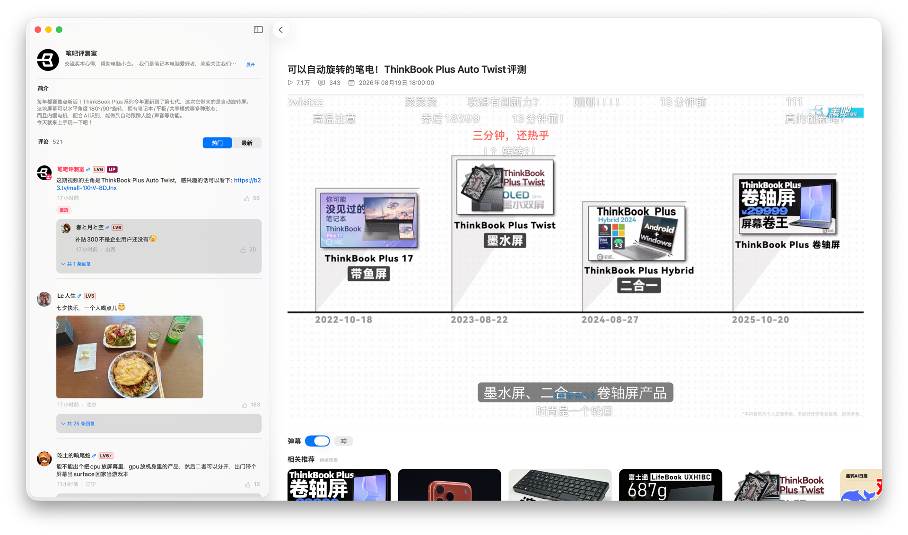

<p align="center">
  
  &nbsp;&nbsp;
  
</p>

<h1 align="center">BiliKit</h1>

<p align="center">
  <strong>克制地浏览，连续地观看。</strong>
</p>

<p align="center">
  为 Mac 设计的原生、高性能、非官方 B 站浏览与播放客户端
</p>

<p align="center">
  
  
  
  <a href="LICENSE"></a>
</p>

> [!IMPORTANT]
> BiliKit 是第三方开源项目，与哔哩哔哩不存在隶属、认可或赞助关系。下载仅通过本仓库 GitHub Releases 提供，
> 标有 Pre-release 的版本用于测试。

## 界面预览

<p align="center">
  
</p>

<p align="center"><sub>首页 · 推荐视频流</sub></p>

<p align="center">
  
</p>

<p align="center"><sub>视频详情 · 播放、弹幕、相关推荐与评论阅读上下文</sub></p>

## 关于 BiliKit

BiliKit 希望成为一个适合日常观看的原生 Mac 客户端：浏览内容、进入视频、切换分 P，
再返回原来的来源页面，都发生在同一个连续的窗口体验中。

播放器、字幕和弹幕共享同一播放时间轴；系统侧栏在浏览状态承担导航，在播放状态承载
视频简介、分 P 与评论阅读上下文。界面优先遵循 Mac 的窗口、滚动、键盘和辅助功能习惯。

## 核心体验

- **原生 Mac 界面**：使用 SwiftUI、AppKit 与 AVKit 构建系统侧栏、视频网格和观看工作区。
- **高性能浏览**：通过原生网格、卡片复用和有界图片管线支持流畅滚动与长列表持续浏览。
- **连续浏览与观看**：从首页、热门、搜索或观看历史进入同窗口视频页，返回时恢复来源上下文。
- **可靠播放**：基于 AVPlayer 的自动画质、seek、倍速和播放生命周期管理。
- **字幕与弹幕**：通过系统字幕菜单选择字幕，并在统一时间轴上渲染弹幕。
- **登录与历史**：支持二维码登录，凭据保存在 Keychain；登录播放时自动同步服务端观看进度。
- **播放上下文**：在稳定播放器周围组织简介、分 P、UP 主信息与只读评论。

## 当前状态

BiliKit 正在完成 v1 的日常观看闭环。首页个性推荐、热门、搜索、二维码登录、观看历史、
视频播放、字幕、弹幕、分 P、只读评论和相关推荐连续观看已经接入，应用内更新使用 Sparkle。
正式候选的签名、公证、安装与跨系统验证状态见[发布清单](docs/release/CHECKLIST.md)。

具体完成证据、当前阶段和未覆盖边界以[路线图](docs/ROADMAP.md)为准。路线图中的候选能力
不代表已经实现或承诺进入某个版本。

## 获取 BiliKit

1. 打开 [GitHub Releases](https://github.com/shiinayane/BiliKit-Mac/releases)，选择正式版本的 Universal DMG；
   如只有 Pre-release，则当前仅提供测试版。
2. 下载 DMG 与同一版本的 `SHA256SUMS`，按[分发说明](DISTRIBUTION.md)核对校验和。
3. 打开 DMG，将 BiliKit 拖入“应用程序”，从“应用程序”启动。

需要 macOS 15 或更高版本，安装包包含 Apple Silicon（`arm64`）和 Intel（`x86_64`）架构。
双架构构建与实际运行验证是不同证据；尚未完成的系统验证以发布说明为准。

应用菜单提供“检查更新…”，也可设置自动检查及自动下载并安装。无更新器的旧 build 1 需要
手动下载安装新版。更新失败时可从同一可信发布页手动安装更高 build 的签名公证版本；
不要关闭 Gatekeeper 或移除 quarantine 来绕过校验。

下载安装、卸载和恢复见[分发说明](DISTRIBUTION.md)，观看进度、凭据与更新网络请求见
[隐私说明](PRIVACY.md)。

<details>
<summary><strong>从源码构建</strong></summary>

### 环境要求

- macOS 15 或更高版本
- 支持 Swift 6 的完整版 Xcode

使用 Xcode 打开 `BiliKitMac.xcworkspace`：日常开发选择 `BiliKitMac` scheme 和 “My Mac”
运行目标；弹幕实验与性能校准选择独立的 `DanmakuLab` scheme。`DanmakuLab` 不进入正式
App target、归档或分发物。

仓库完整质量检查：

```sh
DEVELOPER_DIR=/Applications/Xcode.app/Contents/Developer \
  sh Scripts/run-quality-gates.sh app
```

签名、真实登录、网络播放、VoiceOver、Full Keyboard Access 和性能检查是独立的验证边界；
自动化 Gate 不能替代这些真实环境检查。

</details>

## 产品原则

- **macOS-first**：优先形成自然、稳定的 Mac 观看体验，不以功能数量为目标。
- **状态诚实**：加载、失败、登录限制和远端能力变化都应被准确呈现，不用假内容补齐页面。
- **隐私克制**：Cookie 与 token 只进入短生命周期内存和 Keychain，不进入日志、fixture、
  UserDefaults 或截图。
- **单一观看上下文**：播放器、字幕、弹幕和页面切换围绕同一媒体 identity 与时间轴工作。

## v1 范围

v1 聚焦浏览、搜索、登录、观看历史和连续播放。以下能力不在 v1 范围内：

- 下载、转码、媒体导出和离线媒体库
- 直播
- 多账号
- 区域解锁、DRM 绕过或权限规避
- 评论、关注、收藏、稍后再看等写操作

社区接口来自公开行为研究，可能随服务端变化。BiliKit 将其作为可替换、可测试且可能失败的
外部依赖处理。

## 开发与设计

- [产品愿景与 v1 截线](docs/product/PRODUCT-VISION.md)
- [UI/UX 产品蓝图](docs/product/UIUX-VISION.md)
- [路线图](docs/ROADMAP.md)
- [质量检查与验证边界](docs/development/QUALITY-GATES.md)
- [分发说明](DISTRIBUTION.md)
- [隐私说明](PRIVACY.md)
- [安全问题报告](SECURITY.md)
- [架构决策](docs/adr/)
- [安全边界](docs/security/)
- [真实行为验证记录](docs/validation/)
- [App Icon 设计源文件](Design/AppIcon/v1/)
- [宣传截图与规格](Design/Marketing/v1/)

<details>
<summary><strong>仓库结构与架构方向</strong></summary>

```text
BiliKitMac/                 App 入口、Composition Root、平台宿主与构建资源
Packages/BiliKitCore/       核心模型、Application、Feature 与 adapter 模块
BiliKitMacTests/            App composition 集成测试
Design/                     可追踪的品牌与设计源文件
docs/                       产品、路线图、ADR、安全与验证记录
Scripts/                    架构、秘密、格式、质量检查与本机发布流水线
Tools/                      不进入产品的独立开发工具
```

核心依赖方向：

```text
Bili*Feature -> BiliApplication -> BiliModels
                       ^ ports
           BiliAPI / BiliAuth / BiliPlayback
                       -> BiliNetworking
```

模块职责、Feature 准入和复用边界分别见
[ADR 0004](docs/adr/0004-mvvm-clean-architecture.md)、
[ADR 0006](docs/adr/0006-product-domain-feature-targets.md) 与
[ADR 0009](docs/adr/0009-narrow-biliui-video-card-boundary.md)。

</details>

## 许可证与声明

BiliKit 的源代码及相关工程文档使用 [MIT License](LICENSE)。BiliKit 名称、App Icon、
Logo、`Design/AppIcon/` 与 `Design/Marketing/` 等品牌资产不属于 MIT 授权范围，详情见
[品牌资产权利声明](BRAND-ASSETS.md)。第三方依赖与声明见
[THIRD_PARTY_NOTICES.md](THIRD_PARTY_NOTICES.md)。

哔哩哔哩相关名称与商标归其权利人所有。本项目不包含、复制或声称拥有官方客户端的
品牌资产。
